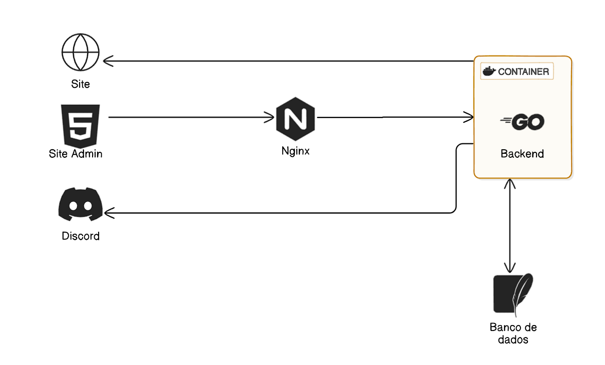

# MangaZX

Uma aplicação em go lang onde entra em um site de mangá e verifica se tem um capítulo novo e envia a notificação para o discord.

## Como funciona
A aplicação em go olha no meu banco de dados quais são os mangas que eu quero receber as noticações
usando um cronjob que roda de hora em hora para verificar se algum capítulo novo foi lançado, caso tenha, eu recebo essa notificação no discord e atualiza meu banco para o último capítulo lançado. Eu cadastro os mangás que eu quero receber as noticações através de um frontend admin feito com HTMX para renderização através do servidor e o deploy é feito em uma VPS utilizando docker e nginx. 

  

## Tecnologias

- Docker
- GO 
- Nginx
- HTMX
- Sqlite (https://turso.tech/)